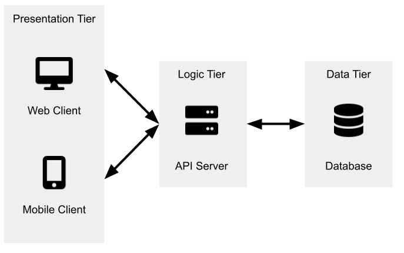
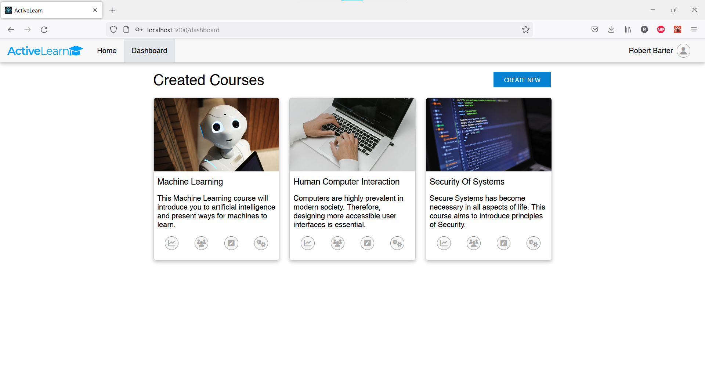
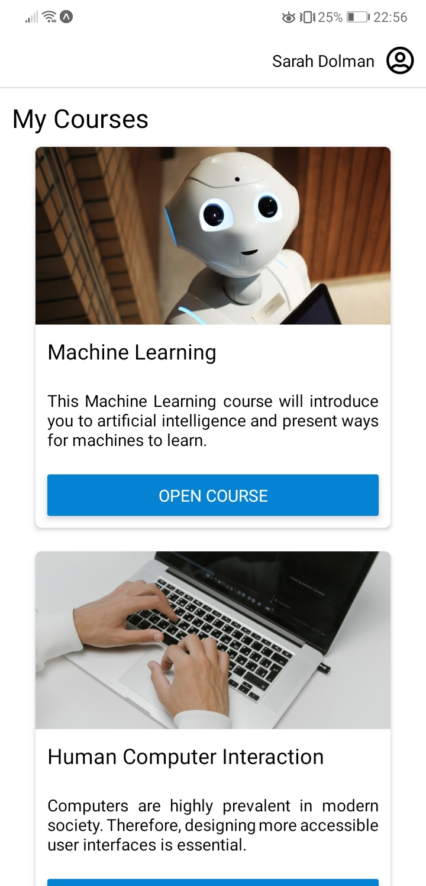

# Master's Project for MSci Computer Science - Interactive Online Learning Platform


## Description
During the past few years, teaching has mostly transitioned online rather than traditional in-person
sessions. Online uploaded lectures often don’t involve any interaction from the students,
therefore students often become disinterested and their engagement drops. This introduces a new
challenge, is it possible to make online lectures as engaging and interactive as in-person ones?

To tackle the problem, I have created a system that offers an interactive experience to the
students while watching uploaded online lectures in order to make the learning process more
engaging and interesting. The project accomplishes this by introducing interactive elements into
the uploaded lectures which are easy for lecturers to setup, and engaging for students to complete.

In essence, the developed system is an interactive learning management system (LMS), which allows
the lecturers to setup interactive elements such as single and multiple choice quizzes,
match pairs activities, and others. These elements would appear on the screen for students as the
students are watching the lectures at timestamps specified by the lecturers. The elements would be
automatically graded, and a detailed summary of student scores would be displayed to the lecturers.

In addition, the system allows the lecturers to structure uploaded lectures into courses, add
supplementary materials, search for and enrol students into the courses, and view how well the
students are performing and engaging with the courses, which allows lecturers to gain detailed
insight into course content difficulty and other aspects of the course, which could further
improve the quality of the courses.

The developed system consists of a backend server that would serve as a REST API for the clients, a
web client for lecturers, and a mobile app for students. The backend server uses `Node.js` and
`Express.js` and communicates with a `MongoDB` database. The web client uses `React.js` and the
mobile client uses `React Native`.

Architecture diagram may be seen below.

<p align="center">
  
</p>

## Screenshots

Here is the web dashboard for lecturers. The lecturers may setup courses (as well as enrol students
into the courses), upload lectures, and add interactive elements to the lectures. Once students have
completed some interactive elements, the interactive elements would be automatically graded and
lecturers would be able to view a detailed summary of student scores.



Here is the mobile dashboard for students. The students may view courses they have been enrolled in
and watch lectures. As they watch lectures, interactive elements will appear on the screen which
they may choose to complete, or to skip and come back later to. If an interactive element has been
completed by the student, it would be automatically graded and displayed to the student and the
lecturer.

<p align="center">
  
</p>

## Running
In order to run the project, clone the repository using `git clone` and follow the below steps.

1. Run `npm start` in `./node-server` to start the backend server
2. Run `npm start` in `./react-client` to start the web client
3. Run `expo start` in `./mobile-client` to start the mobile client and follow instructions in the
   console to run the mobile app on a phone

## Database Config
To run the project an `.env` file should be created in `./node-server/.env`. It should specify a
MongoDB URL and a random secret for JWT:

```
DB_CONNECT = mongodb+srv://mongodb_url
TOKEN_SECRET = random_secret
```
